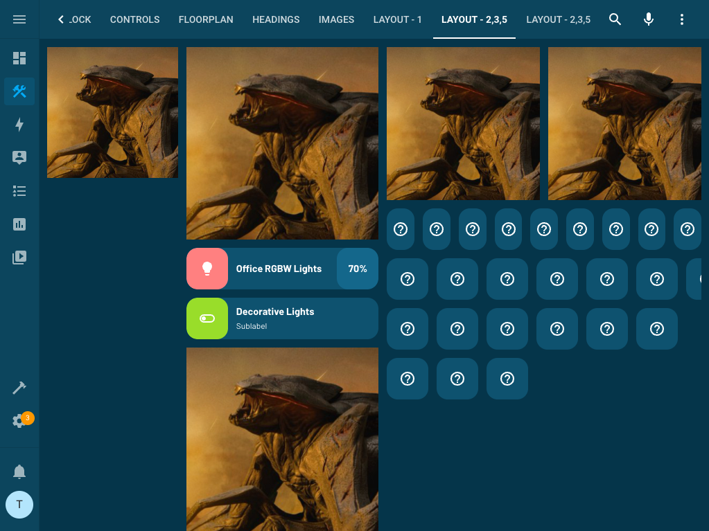
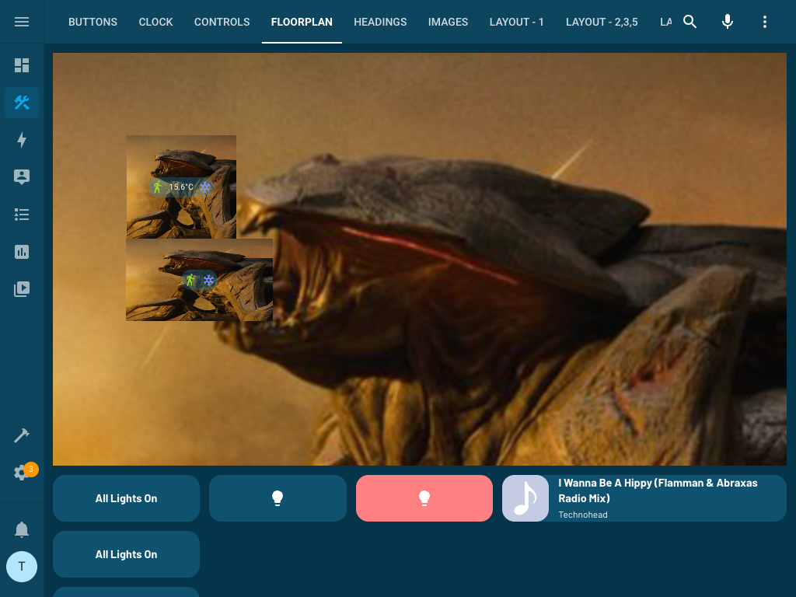
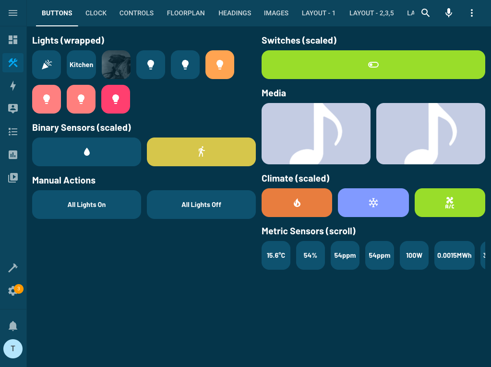
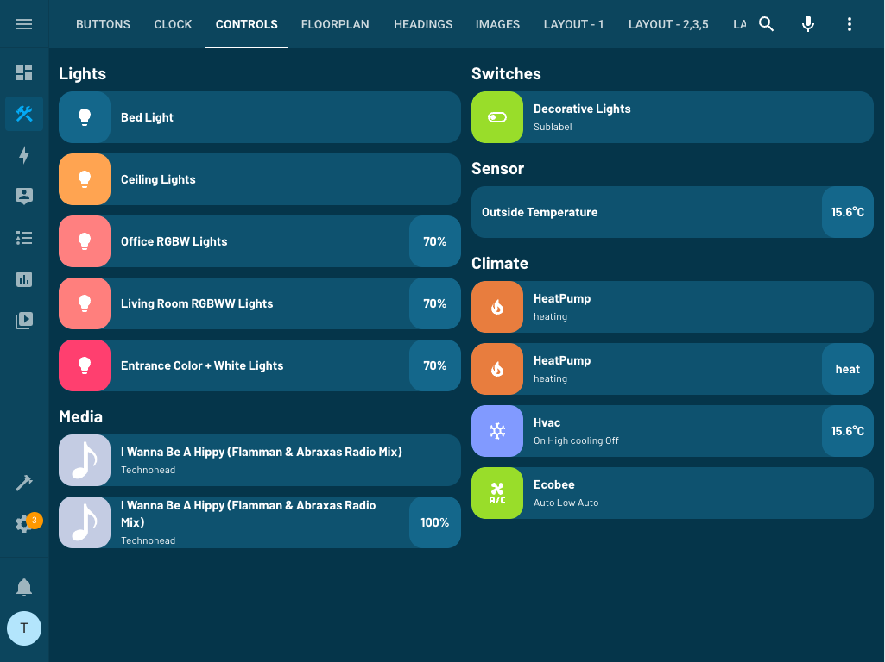
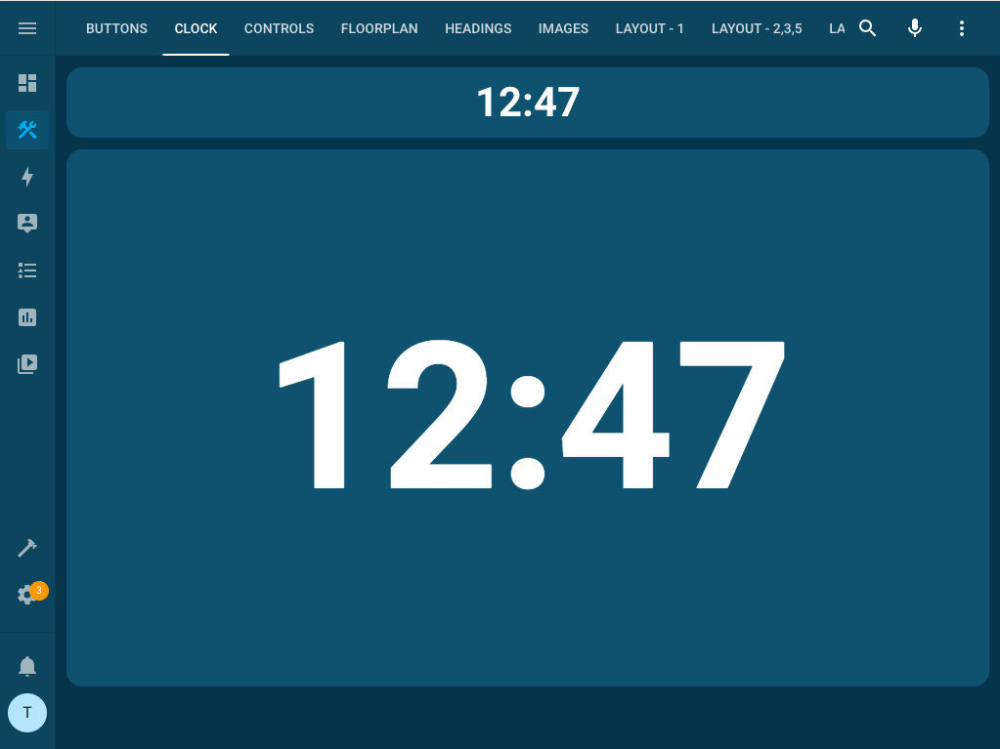
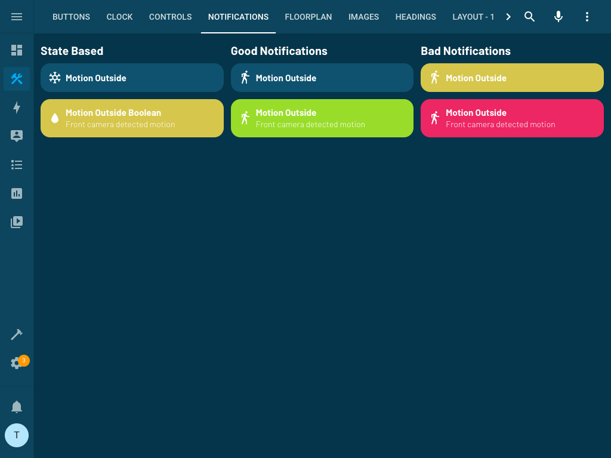

# 🛠️ Muto for Home Assistant

[![hacs][hacs-badge]][hacs-url]
[![release][release-badge]][release-url]
![downloads][downloads-badge]
![build][build-badge]

## What is Muto?

Muto stands for Multi-Tool - a combination of basic UI elements that enable user interaction designed for tablet use.

The principles of Muto might look familiar for those with web-dev experience as the layouts are put in your hands through cards like "flexbox" and such.

Note: Muto has been built and designed for my personal use, so there are likely lots of bugs or edge cases not supported.

### Features

-   🛠 A basic set of components to build complete custom UIs
-   😍 tablet focused designs and interactions - with expectations of horizontal layouts, finger-control and scrolling
-   🖌 Consistent placement of Clocks, Alerts and Security cameras
-   🚀 0 dependencies : no need to install another card.
-   🌈 Themeable without external themes

## Installation

1. Download `muto.js` file from the [latest-release].
2. Put `muto.js` file into your `config/www` folder.
3. Add reference to `muto.js` in Dashboard. There's two way to do that:
    - **Using UI:** _Settings_ → _Dashboards_ → _More Options icon_ → _Resources_ → _Add Resource_ → Set _Url_ as `/local/muto.js` → Set _Resource type_ as `JavaScript Module`.
      **Note:** If you do not see the Resources menu, you will need to enable _Advanced Mode_ in your _User Profile_
    - **Using YAML:** Add following code to `lovelace` section.
        ```yaml
        resources:
            - url: /hacsfiles/lovelace-muto/muto.js
              type: module
        ```
4. _(Optional)_ Install the `Barlow` font from Google Fonts using one of the two methods mentioned in step 3

    - **Using UI:** _Settings_ → _Dashboards_ → _More Options icon_ → _Resources_ → _Add Resource_ → Set _Url_ as `https://fonts.googleapis.com/css2?family=Barlow:wght@300;400;600;700&display=swap` → Set _Resource type_ as `Stylesheet`.
      **Note:** If you do not see the Resources menu, you will need to enable _Advanced Mode_ in your _User Profile_
    - **Using YAML:** Add following code to `lovelace` section.
        ```yaml
        resources:
            - url: https://fonts.googleapis.com/css2?family=Barlow:wght@300;400;600;700&display=swap
              type: css
        ```

5. Reload themes by restarting home assistant, or using the keyboard shortcut `c`, then type `reload themes`
6. Set the `Muto` theme for all users by going to _Developer Tools_ → _Services_. Select the service `Home Assistant Frontend: Set theme`. Select `Muto` from the list of themes, and press _Call Service_.

# Cards

## Layout Card



### Description

Exposes Flexbox (css) styling to home assistant through simple row and column cards.

**Note:** for best outcomes, set the layout type to `panel: true`.

The component is responsive, and will move to a single column layout on narrow devices.

Example use of the card is as follows:

```yaml
- type: custom:muto-layout-card
  columns:
      - flex: 0 0 20%
        cards: ...
      - flex: 2 2 30%
        cards: ...
```

### Configuration

| Name      | Type  | Default  | Description         |
| :-------- | :---- | :------- | :------------------ |
| `columns` | array | Required | An array of columns |

Each column accepts the following configuration:

| Name    | Type   | Default  | Description                                      |
| :------ | :----- | :------- | :----------------------------------------------- |
| `cards` | array  | Required | An array of lovelace cards                       |
| `flex`  | string | Optional | A flex shorthand on how the column should behave |

For more details on flex shorthand: [read this from css-tricks](https://css-tricks.com/snippets/css/a-guide-to-flexbox/#aa-flex).

## Floorplan Card



### Description

Presents a full-width floor plan of the house, with clickable areas that present cards related to the area that you configure.

**Note:** for best outcomes, set the layout type to `panel: true`.

The component is responsive, and will move to a single column layout on narrow devices.

The Floorplan Card is provided `Areas` which represent rooms or areas that you can define.

Example use of the card is as follows:

```yaml
- type: custom:muto-floorplan-card
  floorplan: /local/muto.png
  aspect_ratio: 16/9
  areas:
      - name: Bedroom
        floorplan: /local/muto.png
        top: 20%
        left: 10%
        width: 15%
        height: 25%

        temperature: sensor.outside_temperature
        motion: binary_sensor.movement_backyard
        climate: climate.hvac

        card:
            type: custom:muto-layout-card
            columns:
                - flex: 0 0 20%
                  cards: ...
```

### Configuration

| Name           | Type   | Default  | Description                                                           |
| :------------- | :----- | :------- | :-------------------------------------------------------------------- |
| `floorplan`    | url    | Required | The location of the floorplan to be shown underneath all the areas    |
| `aspect_ratio` | number | Reqiured | The aspect ratio of the floowplan, used to determine the layout rules |
| `areas`        | array  | required | an array of areas to be rendered                                      |

Areas are made up as follows:

| Name          | Type       | Default  | Description                                                                         |
| :------------ | :--------- | :------- | :---------------------------------------------------------------------------------- |
| `name`        | string     | Optional | The name of the area                                                                |
| `floorplan`   | url        | Required | The image of the areas floorplan, rendered over the top of the background floorplan |
| `top`         | percentage | Required | the top position of the area. represented as a % of the whole floorplan             |
| `left`        | percentage | Required | the left position of the area. represented as a % of the whole floorplan            |
| `width`       | percentage | Required | the width of the area. represented as a % of the whole floorplan                    |
| `height`      | percentage | Required | the height of the area. represented as a % of the whole floorplan                   |
| `temperature` | string     | Optional | The id of a temperature entity to be used to show quick stats on the area           |
| `motion`      | string     | Optional | The id of a motion entity to be used to show quick stats on the area                |
| `climate`     | string     | Optional | The id of a climate entity to be used to show quick stats on the area               |
| `card`        | card       | Required | the card to show when the area is clicked                                           |

## Button Card



## Control Card



## Panel Card

### Description

A helper card if you want to use other lovelace cards in your layout but have them visually framed like the rest of Muto.

Example use of the card is as follows:

```yaml
- type: custom:muto-panel-card
  cards:
      - type: markdown
        content: >
            I am inside a muto panel
```

### Configuration

| Name     | Type    | Default                     | Description                              |
| :------- | :------ | :-------------------------- | :--------------------------------------- |
| `cards`  | array   | Required                    | An array of lovelace cards               |
| `padded` | boolean | Optional (defaults to true) | Wether the panel should be padded or not |

## Clock Card



## Notification Card



## Image Card

## Heading Card

## Development server

### Home assistant demo

You can run a demo instance of Home Assistant with docker by running:

```sh
npm run start:hass
```

Once it's done, go to Home Assistant instance [http://localhost:8123](http://localhost:8123) and start configuration.

### Development

In another terminal, install dependencies and run development server:

```sh
npm install
npm start
```

Server will start on port `4000`.

### Home assistant configuration

Once both Home Assistant and muto are running, you have to add a resource to Home Assistant UI:

-   Enable `Advanced Mode` in your profile page
-   Go to Dashboard Resources and add the resource `http://localhost:4000/muto.js`:  
    _Settings_ → _Dashboards_ → _More Options icon_ → _Resources_ → _Add Resource_ → Set _URL_ as `http://localhost:4000/muto.js` → Set _Resource type_ as `JavaScript Module`.

### Build

You can build the `muto.js` file in `dist` folder by running the build command.

```sh
npm run build
```

<!-- Badges -->

[hacs-url]: https://github.com/hacs/integration
[hacs-badge]: https://img.shields.io/badge/HACS-Custom-41BDF5.svg
[release-badge]: https://img.shields.io/github/v/release/d2kagw/lovelace-muto?style=flat-square
[downloads-badge]: https://img.shields.io/github/downloads/d2kagw/lovelace-muto/total?style=flat-square
[build-badge]: https://img.shields.io/github/actions/workflow/status/d2kagw/lovelace-muto/build.yml?branch=main&style=flat-square

<!-- References -->

[hacs]: https://hacs.xyz
[release-url]: https://github.com/d2kagw/lovelace-muto/releases
